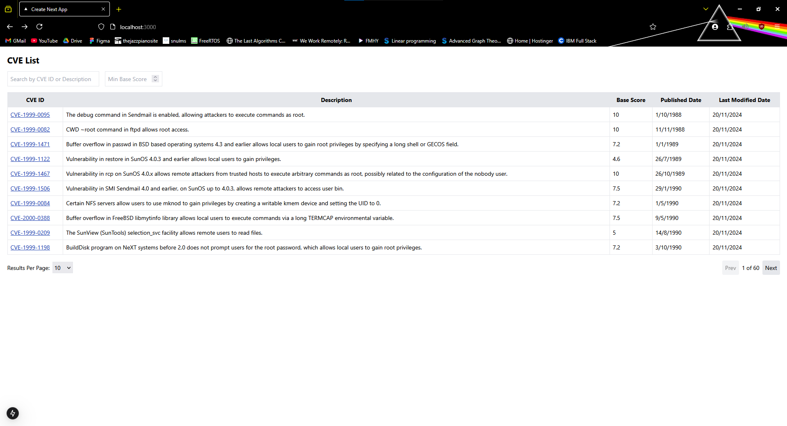
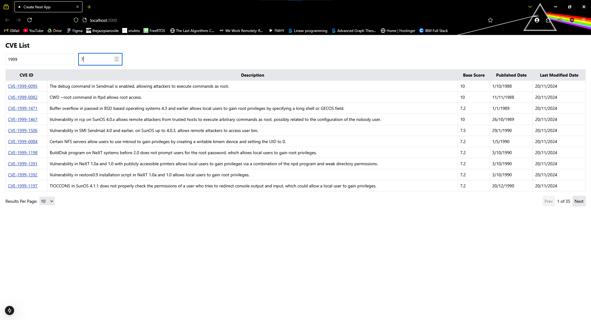

# Securin NVD Assessment 

Developed a full-stack NextJS application to perform the required tasks.

## File Structure
```
cve_fullstack_app  
    |--app
    |   |--api
    |   |   |--cves
    |   |   |   |--[cveId]
    |   |   |   |    |--route.ts    //dynamic api route to show full details
    |   |   |   |--route.ts         //api route to fetch data for list
    |   |--cves
    |   |   |--[cveId]
    |   |   |   |--page.tsx         //app route to display CVE information
    |   |--page.tsx                 //app route to display list of CVEs
    |--lib
    |   |--mongoose.ts              //connect to MongoDB
    |--models
    |   |--cve.ts                   //database schema
```

## Lib

1. `mongoose.ts`

    `connectDB()` to connect to MongoDB.

## Models

1. `cve.ts`

    Contains the mongoose schema for the database.

## Api Routes

1. `/api`

    `fetchAndStoreCVE()` to fetch data from the NVD API and store within the database. The data is fetched in batches of 100.  

    `GET()` to fetch CVEs from MongoDB with pagination and fetch from API if needed, usinf the previous function.

    `POST()` to sync CVEs from NVD API.

2. `/api/cves/[cveId]`

    `GET()` to fetch the details for the CVE with ID `cveId` using dynamic routes. 

## App Routes

1. `/`

    Display the list of CVEs with pagination and option to display upto 100 records at a time. ID, description, base score, published date and last modified date are displayed.

2. `/cves/[cveId]`

    Display all the details of the CVE without having to render ever page beforehand using dynamic routing.

## Screenshots

1. `GET /api?page=1&perPage=10&search=&minScore= 200 in 4522ms`



2. `GET /api?page=3&perPage=100&search=&minScore= 200 in 241ms`


3. `GET /api?page=1&perPage=10&search=CVE-1999-0957&minScore= 200 in 79ms`


4. `GET /api?page=1&perPage=10&search=1999&minScore=8 200 in 122ms`


5. `GET /api?page=1&perPage=10&search=1999&minScore=7 200 in 86ms`



6. `GET /api/cves/CVE-1999-1122 200 in 92ms`

